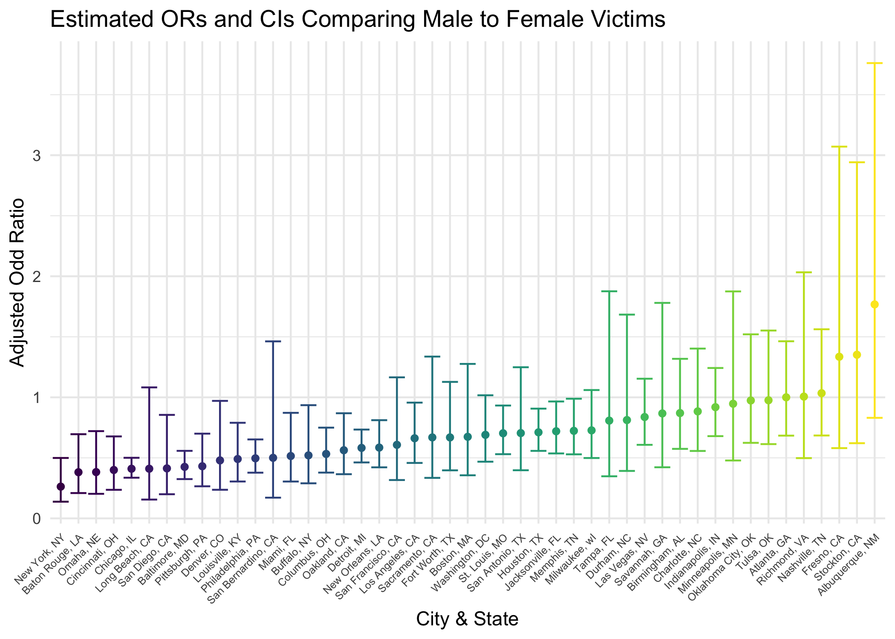

p8106_hw5_tl3196
================
Tianshu Liu

## Problem 1

``` r
# download data
weather_df = 
  rnoaa::meteo_pull_monitors(
    c("USW00094728"),
    var = c("PRCP", "TMIN", "TMAX"), 
    date_min = "2017-01-01",
    date_max = "2017-12-31") %>%
  mutate(
    name = recode(id, USW00094728 = "CentralPark_NY"),
    tmin = tmin / 10,
    tmax = tmax / 10) %>%
  select(name, id, everything())
```

…

## Problem 2

``` r
homicide_df = 
  read_csv("./data/homicide-data.csv") %>% 
  mutate(
    city_state = str_c(city, ", ", state), 
    resolved = as.numeric(disposition == "Closed by arrest"),
    ) %>% 
  filter(
    !(city_state %in% c("Dallas, TX", "Phoenix, AZ", "Kansas City, MO", "Tulsa, AL")),
    victim_race %in% c("White", "Black")
  ) %>% 
  mutate(
    victim_age = as.numeric(victim_age),
    victim_race = fct(victim_race)
  )
  
homicide_df
```

    ## # A tibble: 39,693 × 14
    ##    uid   repor…¹ victi…² victi…³ victi…⁴ victi…⁵ victi…⁶ city  state   lat   lon
    ##    <chr>   <dbl> <chr>   <chr>   <fct>     <dbl> <chr>   <chr> <chr> <dbl> <dbl>
    ##  1 Alb-…  2.01e7 SATTER… VIVIANA White        15 Female  Albu… NM     35.1 -107.
    ##  2 Alb-…  2.01e7 MULA    VIVIAN  White        72 Female  Albu… NM     35.1 -107.
    ##  3 Alb-…  2.01e7 BOOK    GERALD… White        91 Female  Albu… NM     35.2 -107.
    ##  4 Alb-…  2.01e7 MARTIN… GUSTAVO White        56 Male    Albu… NM     35.1 -107.
    ##  5 Alb-…  2.01e7 LUJAN   KEVIN   White        NA Male    Albu… NM     35.1 -107.
    ##  6 Alb-…  2.01e7 GRAY    STEFAN… White        43 Female  Albu… NM     35.1 -107.
    ##  7 Alb-…  2.01e7 DAVID   LARRY   White        52 Male    Albu… NM     NA     NA 
    ##  8 Alb-…  2.01e7 BRITO   ELIZAB… White        22 Female  Albu… NM     35.1 -107.
    ##  9 Alb-…  2.01e7 KING    TEVION  Black        15 Male    Albu… NM     35.1 -107.
    ## 10 Alb-…  2.01e7 BOYKIN  CEDRIC  Black        25 Male    Albu… NM     35.1 -107.
    ## # … with 39,683 more rows, 3 more variables: disposition <chr>,
    ## #   city_state <chr>, resolved <dbl>, and abbreviated variable names
    ## #   ¹​reported_date, ²​victim_last, ³​victim_first, ⁴​victim_race, ⁵​victim_age,
    ## #   ⁶​victim_sex

Fit a logistic regression with resolved vs unresolved as the outcome and
victim age, sex and race as predictors for the city of Baltimore, MD

``` r
# fit logistic regression for Baltimore
balt_logi_reg = 
  homicide_df %>% filter(city_state == "Baltimore, MD") %>% 
  glm(
  formula = resolved ~ victim_age + victim_sex + victim_race, 
  data = .,
  family = binomial()
) 

summary(balt_logi_reg)
```

    ## 
    ## Call:
    ## glm(formula = resolved ~ victim_age + victim_sex + victim_race, 
    ##     family = binomial(), data = .)
    ## 
    ## Deviance Residuals: 
    ##     Min       1Q   Median       3Q      Max  
    ## -1.6223  -0.8958  -0.8688   1.4699   1.6579  
    ## 
    ## Coefficients:
    ##                   Estimate Std. Error z value Pr(>|z|)    
    ## (Intercept)       1.151737   0.236725   4.865 1.14e-06 ***
    ## victim_age       -0.006727   0.003324  -2.024    0.043 *  
    ## victim_sexMale   -0.854463   0.138176  -6.184 6.26e-10 ***
    ## victim_raceBlack -0.841756   0.174716  -4.818 1.45e-06 ***
    ## ---
    ## Signif. codes:  0 '***' 0.001 '**' 0.01 '*' 0.05 '.' 0.1 ' ' 1
    ## 
    ## (Dispersion parameter for binomial family taken to be 1)
    ## 
    ##     Null deviance: 3567.9  on 2752  degrees of freedom
    ## Residual deviance: 3492.7  on 2749  degrees of freedom
    ## AIC: 3500.7
    ## 
    ## Number of Fisher Scoring iterations: 4

``` r
balt_logi_reg %>% broom::tidy()
```

    ## # A tibble: 4 × 5
    ##   term             estimate std.error statistic  p.value
    ##   <chr>               <dbl>     <dbl>     <dbl>    <dbl>
    ## 1 (Intercept)       1.15      0.237        4.87 1.14e- 6
    ## 2 victim_age       -0.00673   0.00332     -2.02 4.30e- 2
    ## 3 victim_sexMale   -0.854     0.138       -6.18 6.26e-10
    ## 4 victim_raceBlack -0.842     0.175       -4.82 1.45e- 6

Obtain the estimate and CI of the adjusted odds ratio for solving
homicides comparing male victims to female victims keeping all other
variables fixed.

``` r
# estimate and CI of the adjusted OR for sex = male in solving homicides 
balt_logi_reg %>% 
  broom::tidy() %>% 
  filter(str_detect(term,"Male")) %>% 
  mutate(
    log_or = estimate,
    adj_or = exp(estimate),
    adj_or_ci_low = exp(estimate - 1.96 * std.error),
    adj_or_ci_high = exp(estimate + 1.96 * std.error)
    ) %>% 
  select(log_or, adj_or, adj_or_ci_low, adj_or_ci_high)
```

    ## # A tibble: 1 × 4
    ##   log_or adj_or adj_or_ci_low adj_or_ci_high
    ##    <dbl>  <dbl>         <dbl>          <dbl>
    ## 1 -0.854  0.426         0.325          0.558

Iterate each cities in the data set.

``` r
homicide_or = 
  homicide_df %>% 
  nest(data = -city_state) %>% 
  mutate(
    logi_reg = map(.x = data, ~glm(formula = resolved ~ victim_age + victim_sex + victim_race, data = .x, family = binomial())),
    logi_results = map(logi_reg, broom::tidy)
  ) %>% 
  select(-data, -logi_reg) %>% 
  unnest(logi_results) %>% 
  filter(str_detect(term,"Male")) %>% 
  mutate(
    log_or = estimate,
    adj_or = exp(estimate),
    adj_or_ci_low = exp(estimate - 1.96 * std.error),
    adj_or_ci_high = exp(estimate + 1.96 * std.error)
    ) %>% 
  select(city_state, log_or, adj_or, adj_or_ci_low, adj_or_ci_high)

homicide_or
```

    ## # A tibble: 47 × 5
    ##    city_state          log_or adj_or adj_or_ci_low adj_or_ci_high
    ##    <chr>                <dbl>  <dbl>         <dbl>          <dbl>
    ##  1 Albuquerque, NM  0.570      1.77          0.831          3.76 
    ##  2 Atlanta, GA      0.0000771  1.00          0.684          1.46 
    ##  3 Baltimore, MD   -0.854      0.426         0.325          0.558
    ##  4 Baton Rouge, LA -0.964      0.381         0.209          0.695
    ##  5 Birmingham, AL  -0.139      0.870         0.574          1.32 
    ##  6 Boston, MA      -0.395      0.674         0.356          1.28 
    ##  7 Buffalo, NY     -0.653      0.521         0.290          0.935
    ##  8 Charlotte, NC   -0.123      0.884         0.557          1.40 
    ##  9 Chicago, IL     -0.891      0.410         0.336          0.501
    ## 10 Cincinnati, OH  -0.917      0.400         0.236          0.677
    ## # … with 37 more rows

Create a plot that shows the estimated ORs and CIs for each city.

``` r
homicide_or %>% 
  mutate(
    city_state = fct_reorder(city_state, adj_or)
  ) %>% 
  ggplot(aes(x = city_state, y = adj_or, color = city_state)) + 
  geom_point() + 
  geom_errorbar(aes(ymin = adj_or_ci_low, ymax = adj_or_ci_high)) + 
  theme(legend.position = "none") + 
  theme(axis.text.x = element_text(size=6, angle=45, hjust = 1)) + 
  labs(
    x = "City & State",
    y = "Adjusted Odd Ratio",
    title = "Estimated ORs and CIs Comparing Male to Female Victims"
  )
```



## Problem 3
