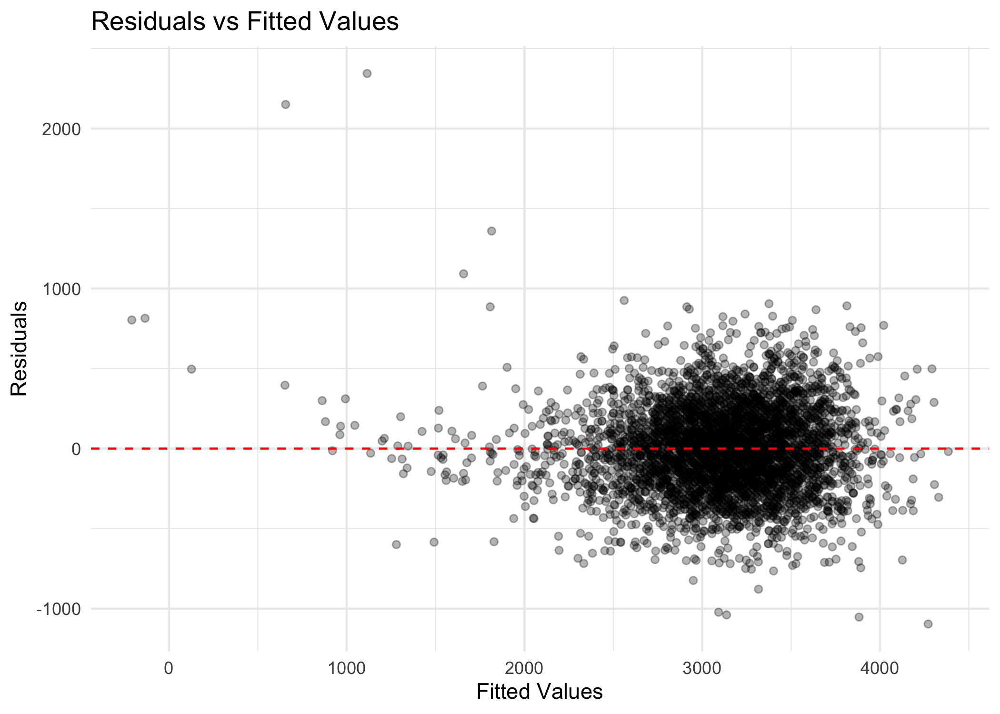

p8106_hw5_tl3196
================
Tianshu Liu

## Problem 1

``` r
# download data
weather_df = 
  rnoaa::meteo_pull_monitors(
    c("USW00094728"),
    var = c("PRCP", "TMIN", "TMAX"), 
    date_min = "2017-01-01",
    date_max = "2017-12-31") %>%
  mutate(
    name = recode(id, USW00094728 = "CentralPark_NY"),
    tmin = tmin / 10,
    tmax = tmax / 10) %>%
  select(name, id, everything())
```

…

## Problem 2

``` r
homicide_df = 
  read_csv("./data/homicide-data.csv") %>% 
  mutate(
    city_state = str_c(city, ", ", state), 
    resolved = as.numeric(disposition == "Closed by arrest"),
    ) %>% 
  filter(
    !(city_state %in% c("Dallas, TX", "Phoenix, AZ", "Kansas City, MO", "Tulsa, AL")),
    victim_race %in% c("White", "Black")
  ) %>% 
  mutate(
    victim_age = as.numeric(victim_age),
    victim_race = fct(victim_race)
  )
  
homicide_df
```

    ## # A tibble: 39,693 × 14
    ##    uid   repor…¹ victi…² victi…³ victi…⁴ victi…⁵ victi…⁶ city  state   lat   lon
    ##    <chr>   <dbl> <chr>   <chr>   <fct>     <dbl> <chr>   <chr> <chr> <dbl> <dbl>
    ##  1 Alb-…  2.01e7 SATTER… VIVIANA White        15 Female  Albu… NM     35.1 -107.
    ##  2 Alb-…  2.01e7 MULA    VIVIAN  White        72 Female  Albu… NM     35.1 -107.
    ##  3 Alb-…  2.01e7 BOOK    GERALD… White        91 Female  Albu… NM     35.2 -107.
    ##  4 Alb-…  2.01e7 MARTIN… GUSTAVO White        56 Male    Albu… NM     35.1 -107.
    ##  5 Alb-…  2.01e7 LUJAN   KEVIN   White        NA Male    Albu… NM     35.1 -107.
    ##  6 Alb-…  2.01e7 GRAY    STEFAN… White        43 Female  Albu… NM     35.1 -107.
    ##  7 Alb-…  2.01e7 DAVID   LARRY   White        52 Male    Albu… NM     NA     NA 
    ##  8 Alb-…  2.01e7 BRITO   ELIZAB… White        22 Female  Albu… NM     35.1 -107.
    ##  9 Alb-…  2.01e7 KING    TEVION  Black        15 Male    Albu… NM     35.1 -107.
    ## 10 Alb-…  2.01e7 BOYKIN  CEDRIC  Black        25 Male    Albu… NM     35.1 -107.
    ## # … with 39,683 more rows, 3 more variables: disposition <chr>,
    ## #   city_state <chr>, resolved <dbl>, and abbreviated variable names
    ## #   ¹​reported_date, ²​victim_last, ³​victim_first, ⁴​victim_race, ⁵​victim_age,
    ## #   ⁶​victim_sex

Fit a logistic regression with resolved vs unresolved as the outcome and
victim age, sex and race as predictors for the city of Baltimore, MD

``` r
# fit logistic regression for Baltimore
balt_logi_reg = 
  homicide_df %>% filter(city_state == "Baltimore, MD") %>% 
  glm(
  formula = resolved ~ victim_age + victim_sex + victim_race, 
  data = .,
  family = binomial()
) 

summary(balt_logi_reg)
```

    ## 
    ## Call:
    ## glm(formula = resolved ~ victim_age + victim_sex + victim_race, 
    ##     family = binomial(), data = .)
    ## 
    ## Deviance Residuals: 
    ##     Min       1Q   Median       3Q      Max  
    ## -1.6223  -0.8958  -0.8688   1.4699   1.6579  
    ## 
    ## Coefficients:
    ##                   Estimate Std. Error z value Pr(>|z|)    
    ## (Intercept)       1.151737   0.236725   4.865 1.14e-06 ***
    ## victim_age       -0.006727   0.003324  -2.024    0.043 *  
    ## victim_sexMale   -0.854463   0.138176  -6.184 6.26e-10 ***
    ## victim_raceBlack -0.841756   0.174716  -4.818 1.45e-06 ***
    ## ---
    ## Signif. codes:  0 '***' 0.001 '**' 0.01 '*' 0.05 '.' 0.1 ' ' 1
    ## 
    ## (Dispersion parameter for binomial family taken to be 1)
    ## 
    ##     Null deviance: 3567.9  on 2752  degrees of freedom
    ## Residual deviance: 3492.7  on 2749  degrees of freedom
    ## AIC: 3500.7
    ## 
    ## Number of Fisher Scoring iterations: 4

``` r
balt_logi_reg %>% broom::tidy()
```

    ## # A tibble: 4 × 5
    ##   term             estimate std.error statistic  p.value
    ##   <chr>               <dbl>     <dbl>     <dbl>    <dbl>
    ## 1 (Intercept)       1.15      0.237        4.87 1.14e- 6
    ## 2 victim_age       -0.00673   0.00332     -2.02 4.30e- 2
    ## 3 victim_sexMale   -0.854     0.138       -6.18 6.26e-10
    ## 4 victim_raceBlack -0.842     0.175       -4.82 1.45e- 6

Obtain the estimate and CI of the adjusted odds ratio for solving
homicides comparing male victims to female victims keeping all other
variables fixed.

``` r
# estimate and CI of the adjusted OR for sex = male in solving homicides 
balt_logi_reg %>% 
  broom::tidy() %>% 
  filter(str_detect(term,"Male")) %>% 
  mutate(
    log_or = estimate,
    adj_or = exp(estimate),
    adj_or_ci_low = exp(estimate - 1.96 * std.error),
    adj_or_ci_high = exp(estimate + 1.96 * std.error)
    ) %>% 
  select(log_or, adj_or, adj_or_ci_low, adj_or_ci_high)
```

    ## # A tibble: 1 × 4
    ##   log_or adj_or adj_or_ci_low adj_or_ci_high
    ##    <dbl>  <dbl>         <dbl>          <dbl>
    ## 1 -0.854  0.426         0.325          0.558

Iterate each cities in the data set.

``` r
homicide_or = 
  homicide_df %>% 
  nest(data = -city_state) %>% 
  mutate(
    logi_reg = map(.x = data, ~glm(formula = resolved ~ victim_age + victim_sex + victim_race, data = .x, family = binomial())),
    logi_results = map(logi_reg, broom::tidy)
  ) %>% 
  select(-data, -logi_reg) %>% 
  unnest(logi_results) %>% 
  filter(str_detect(term,"Male")) %>% 
  mutate(
    log_or = estimate,
    adj_or = exp(estimate),
    adj_or_ci_low = exp(estimate - 1.96 * std.error),
    adj_or_ci_high = exp(estimate + 1.96 * std.error)
    ) %>% 
  select(city_state, log_or, adj_or, adj_or_ci_low, adj_or_ci_high)

homicide_or
```

    ## # A tibble: 47 × 5
    ##    city_state          log_or adj_or adj_or_ci_low adj_or_ci_high
    ##    <chr>                <dbl>  <dbl>         <dbl>          <dbl>
    ##  1 Albuquerque, NM  0.570      1.77          0.831          3.76 
    ##  2 Atlanta, GA      0.0000771  1.00          0.684          1.46 
    ##  3 Baltimore, MD   -0.854      0.426         0.325          0.558
    ##  4 Baton Rouge, LA -0.964      0.381         0.209          0.695
    ##  5 Birmingham, AL  -0.139      0.870         0.574          1.32 
    ##  6 Boston, MA      -0.395      0.674         0.356          1.28 
    ##  7 Buffalo, NY     -0.653      0.521         0.290          0.935
    ##  8 Charlotte, NC   -0.123      0.884         0.557          1.40 
    ##  9 Chicago, IL     -0.891      0.410         0.336          0.501
    ## 10 Cincinnati, OH  -0.917      0.400         0.236          0.677
    ## # … with 37 more rows

Create a plot that shows the estimated ORs and CIs for each city.

``` r
homicide_or %>% 
  mutate(
    city_state = fct_reorder(city_state, adj_or)
  ) %>% 
  ggplot(aes(x = city_state, y = adj_or, color = city_state)) + 
  geom_point() + 
  geom_errorbar(aes(ymin = adj_or_ci_low, ymax = adj_or_ci_high)) + 
  theme(legend.position = "none") + 
  theme(axis.text.x = element_text(size=6, angle=45, hjust = 1)) + 
  labs(
    x = "City & State",
    y = "Adjusted Odd Ratio",
    title = "Estimated ORs and CIs Comparing Male to Female Victims"
  )
```


## Problem 3

``` r
# import data from csv file
birthweight_df = 
  read_csv("./data/birthweight.csv") %>% 
  mutate(
    babysex = factor(babysex),
    frace = factor(frace),
    malform = factor(malform),
    mrace = factor(mrace)
  )

# check missing data 
skimr::skim(birthweight_df)
```

|                                                  |                |
|:-------------------------------------------------|:---------------|
| Name                                             | birthweight_df |
| Number of rows                                   | 4342           |
| Number of columns                                | 20             |
| \_\_\_\_\_\_\_\_\_\_\_\_\_\_\_\_\_\_\_\_\_\_\_   |                |
| Column type frequency:                           |                |
| factor                                           | 4              |
| numeric                                          | 16             |
| \_\_\_\_\_\_\_\_\_\_\_\_\_\_\_\_\_\_\_\_\_\_\_\_ |                |
| Group variables                                  | None           |

Data summary

**Variable type: factor**

| skim_variable | n_missing | complete_rate | ordered | n_unique | top_counts                      |
|:--------------|----------:|--------------:|:--------|---------:|:--------------------------------|
| babysex       |         0 |             1 | FALSE   |        2 | 1: 2230, 2: 2112                |
| frace         |         0 |             1 | FALSE   |        5 | 1: 2123, 2: 1911, 4: 248, 3: 46 |
| malform       |         0 |             1 | FALSE   |        2 | 0: 4327, 1: 15                  |
| mrace         |         0 |             1 | FALSE   |        4 | 1: 2147, 2: 1909, 4: 243, 3: 43 |

**Variable type: numeric**

| skim_variable | n_missing | complete_rate |    mean |     sd |     p0 |     p25 |     p50 |     p75 |   p100 | hist  |
|:--------------|----------:|--------------:|--------:|-------:|-------:|--------:|--------:|--------:|-------:|:------|
| bhead         |         0 |             1 |   33.65 |   1.62 |  21.00 |   33.00 |   34.00 |   35.00 |   41.0 | ▁▁▆▇▁ |
| blength       |         0 |             1 |   49.75 |   2.72 |  20.00 |   48.00 |   50.00 |   51.00 |   63.0 | ▁▁▁▇▁ |
| bwt           |         0 |             1 | 3114.40 | 512.15 | 595.00 | 2807.00 | 3132.50 | 3459.00 | 4791.0 | ▁▁▇▇▁ |
| delwt         |         0 |             1 |  145.57 |  22.21 |  86.00 |  131.00 |  143.00 |  157.00 |  334.0 | ▅▇▁▁▁ |
| fincome       |         0 |             1 |   44.11 |  25.98 |   0.00 |   25.00 |   35.00 |   65.00 |   96.0 | ▃▇▅▂▃ |
| gaweeks       |         0 |             1 |   39.43 |   3.15 |  17.70 |   38.30 |   39.90 |   41.10 |   51.3 | ▁▁▂▇▁ |
| menarche      |         0 |             1 |   12.51 |   1.48 |   0.00 |   12.00 |   12.00 |   13.00 |   19.0 | ▁▁▂▇▁ |
| mheight       |         0 |             1 |   63.49 |   2.66 |  48.00 |   62.00 |   63.00 |   65.00 |   77.0 | ▁▁▇▂▁ |
| momage        |         0 |             1 |   20.30 |   3.88 |  12.00 |   18.00 |   20.00 |   22.00 |   44.0 | ▅▇▂▁▁ |
| parity        |         0 |             1 |    0.00 |   0.10 |   0.00 |    0.00 |    0.00 |    0.00 |    6.0 | ▇▁▁▁▁ |
| pnumlbw       |         0 |             1 |    0.00 |   0.00 |   0.00 |    0.00 |    0.00 |    0.00 |    0.0 | ▁▁▇▁▁ |
| pnumsga       |         0 |             1 |    0.00 |   0.00 |   0.00 |    0.00 |    0.00 |    0.00 |    0.0 | ▁▁▇▁▁ |
| ppbmi         |         0 |             1 |   21.57 |   3.18 |  13.07 |   19.53 |   21.03 |   22.91 |   46.1 | ▃▇▁▁▁ |
| ppwt          |         0 |             1 |  123.49 |  20.16 |  70.00 |  110.00 |  120.00 |  134.00 |  287.0 | ▅▇▁▁▁ |
| smoken        |         0 |             1 |    4.15 |   7.41 |   0.00 |    0.00 |    0.00 |    5.00 |   60.0 | ▇▁▁▁▁ |
| wtgain        |         0 |             1 |   22.08 |  10.94 | -46.00 |   15.00 |   22.00 |   28.00 |   89.0 | ▁▁▇▁▁ |

``` r
birthweight_df
```

    ## # A tibble: 4,342 × 20
    ##    babysex bhead blength   bwt delwt fincome frace gaweeks malform menarche
    ##    <fct>   <dbl>   <dbl> <dbl> <dbl>   <dbl> <fct>   <dbl> <fct>      <dbl>
    ##  1 2          34      51  3629   177      35 1        39.9 0             13
    ##  2 1          34      48  3062   156      65 2        25.9 0             14
    ##  3 2          36      50  3345   148      85 1        39.9 0             12
    ##  4 1          34      52  3062   157      55 1        40   0             14
    ##  5 2          34      52  3374   156       5 1        41.6 0             13
    ##  6 1          33      52  3374   129      55 1        40.7 0             12
    ##  7 2          33      46  2523   126      96 2        40.3 0             14
    ##  8 2          33      49  2778   140       5 1        37.4 0             12
    ##  9 1          36      52  3515   146      85 1        40.3 0             11
    ## 10 1          33      50  3459   169      75 2        40.7 0             12
    ## # … with 4,332 more rows, and 10 more variables: mheight <dbl>, momage <dbl>,
    ## #   mrace <fct>, parity <dbl>, pnumlbw <dbl>, pnumsga <dbl>, ppbmi <dbl>,
    ## #   ppwt <dbl>, smoken <dbl>, wtgain <dbl>

``` r
# histogram plot for baby weight
birthweight_df %>% 
  ggplot(aes(x = bwt)) + 
  geom_histogram() + 
  labs(
    x = "Birthweight",
    y = "Count",
    title = "Histogram for Birthweight"
  )
```


``` r
# boxplot for baby weight
birthweight_df %>% 
  ggplot(aes(y = bwt)) + 
  geom_boxplot() + 
  labs(
    y = "Birthweight",
    title = "Boxplot for Birthweight"
  )
```


From the plots, the distribution of `bwt` is almost symmetric and
normal. Thus, no transformation is necessary before regression.

Use `LASSO` to select predictors in the hypothesized model.

``` r
# LASSO
# define response variable & potential predictors 
response <- pull(birthweight_df, bwt)
predictors <- data.matrix(birthweight_df %>% select(-bwt))

library(glmnet)

# perform cross-validation to find optimal lambda value
cv_model <- cv.glmnet(predictors, response, alpha = 1)

# find optimal lambda value that minimizes test MSE
best_lambda <- cv_model$lambda.min
best_lambda
```

    ## [1] 1.195867

``` r
# produce plot of test MSE by lambda value
plot(cv_model) 
```


``` r
# find coefficients of best model
best_model <- glmnet(predictors, response, alpha = 1, lambda = best_lambda)
coef(best_model)
```

    ## 20 x 1 sparse Matrix of class "dgCMatrix"
    ##                        s0
    ## (Intercept) -6202.4418977
    ## babysex        29.6772575
    ## bhead         134.1023143
    ## blength        76.3037735
    ## delwt           1.1328554
    ## fincome         0.6276568
    ## frace         -11.4858669
    ## gaweeks        11.8463499
    ## malform         .        
    ## menarche       -3.2986542
    ## mheight         5.0803147
    ## momage          3.1750560
    ## mrace         -42.1072569
    ## parity         78.0826474
    ## pnumlbw         .        
    ## pnumsga         .        
    ## ppbmi           .        
    ## ppwt            .        
    ## smoken         -3.5338391
    ## wtgain          2.7364227

Remain the predictors in the hypothesized regression model whose
coefficients is not zero in the table above.

``` r
# hypothesized model
hypo_model = lm(bwt ~ babysex + bhead + blength + delwt + fincome + frace + gaweeks + menarche + mheight + momage + mrace + parity + smoken + wtgain, data = birthweight_df)

# calculate rmse for hypothesized model
rmse(hypo_model, birthweight_df)
```

    ## [1] 271.7855

``` r
# make a plot of model residuals against fitted values
birthweight_df %>% 
  add_predictions(hypo_model) %>% 
  add_residuals(hypo_model) %>% 
  ggplot(aes(x = pred, y = resid)) + 
  geom_point(alpha = .3) + 
  geom_hline(yintercept=0, linetype="dashed", color = "red") + 
  labs(
    x = "Fitted Values",
    y = "Residuals",
    title = "Residuals vs Fitted Values"
  )
```


Compare models using cross validation.

-   One using head circumference, length, sex, and all interactions
    (including the three-way interaction) between these

``` r
# split cross validation df
cv_df = crossv_mc(birthweight_df, 100)

# cross validation 
cv_df = 
  cv_df %>% 
  mutate(
    train = map(train, as.tibble),
    test = map(test, as.tibble)
  ) %>% 
  mutate(
    hypo_model = map(.x = train, ~lm(bwt ~ babysex + bhead + blength + delwt + fincome + frace + gaweeks + menarche + mheight + momage + mrace + parity + smoken + wtgain, data = .x)),
    main_model = map(.x = train, ~lm(bwt ~ blength + gaweeks, data = .x)),
    interact_model = map(.x = train, ~lm(bwt ~ babysex + bhead + blength + babysex * bhead + babysex * blength + bhead * blength + babysex * bhead * blength, data = .x))
  ) %>% 
  mutate(
    rmse_hypo = map2_dbl(.x = hypo_model, .y = test, ~rmse(.x, .y)),
    rmse_main = map2_dbl(.x = main_model, .y = test, ~rmse(.x, .y)),
    rmse_interact = map2_dbl(.x = interact_model, .y = test, ~rmse(.x, .y))
  )

cv_df 
```

    ## # A tibble: 100 × 9
    ##    train    test     .id   hypo_model main_model inter…¹ rmse_…² rmse_…³ rmse_…⁴
    ##    <list>   <list>   <chr> <list>     <list>     <list>    <dbl>   <dbl>   <dbl>
    ##  1 <tibble> <tibble> 001   <lm>       <lm>       <lm>       275.    348.    294.
    ##  2 <tibble> <tibble> 002   <lm>       <lm>       <lm>       282.    359.    303.
    ##  3 <tibble> <tibble> 003   <lm>       <lm>       <lm>       273.    346.    293.
    ##  4 <tibble> <tibble> 004   <lm>       <lm>       <lm>       271.    336.    282.
    ##  5 <tibble> <tibble> 005   <lm>       <lm>       <lm>       264.    314.    280.
    ##  6 <tibble> <tibble> 006   <lm>       <lm>       <lm>       286.    344.    306.
    ##  7 <tibble> <tibble> 007   <lm>       <lm>       <lm>       269.    331.    283.
    ##  8 <tibble> <tibble> 008   <lm>       <lm>       <lm>       258.    306.    280.
    ##  9 <tibble> <tibble> 009   <lm>       <lm>       <lm>       271.    325.    284.
    ## 10 <tibble> <tibble> 010   <lm>       <lm>       <lm>       280.    328.    294.
    ## # … with 90 more rows, and abbreviated variable names ¹​interact_model,
    ## #   ²​rmse_hypo, ³​rmse_main, ⁴​rmse_interact

``` r
# boxplot for 3 models
cv_df %>% 
  select(starts_with("rmse")) %>% 
  pivot_longer(
    everything(),
    names_to = "model",
    values_to = "rmse",
    names_prefix = "rmse_"
  ) %>% 
  mutate(model = fct_inorder(model)) %>% 
  ggplot(aes(x = model, y = rmse)) + 
  geom_boxplot() + 
  labs(
    x = "Models",
    y = "RMSE",
    titles = "RMSE Boxplots for Models"
  )
```



According to the boxplot, the RMSEs are `hypo < interact < main`. Since
lower RMSE indicates a better fit, the hypothesized model selecting
predictors based on LASSO has the best fit among all models.
